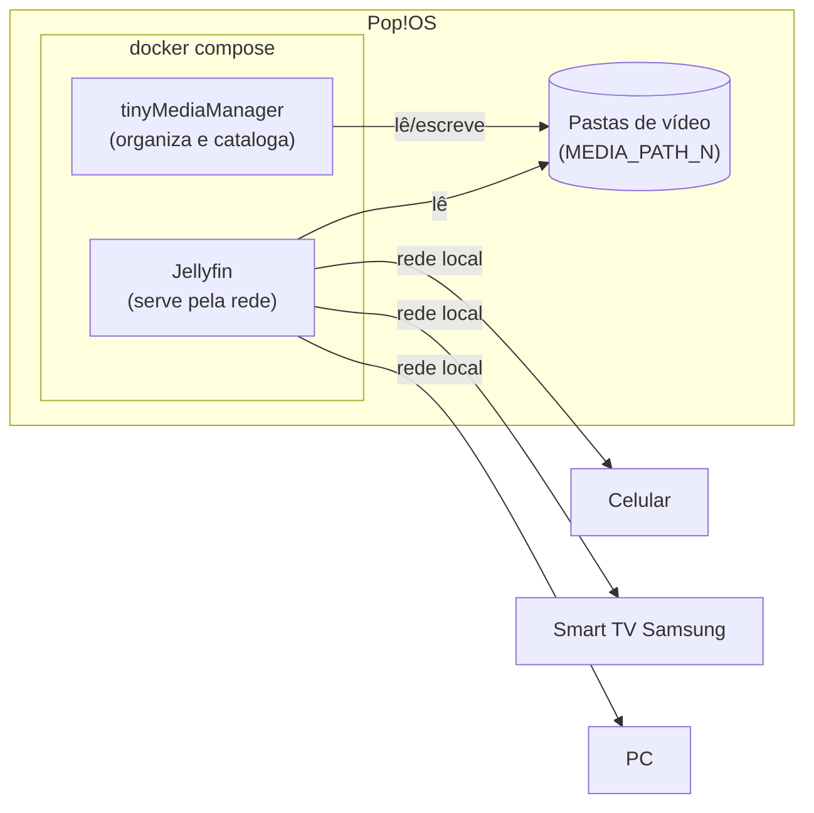

# Media Vault

Servidor pessoal de mídia para acessar seus vídeos de qualquer dispositivo na rede local — celular, PC ou Smart TV — sem depender de apps que podem sumir da loja (como aconteceu com o VLC na Samsung Store).

Stack: [tinyMediaManager](https://www.tinymediamanager.org/) para organizar e catalogar os arquivos + [Jellyfin](https://jellyfin.org/) para servi-los pela rede, tudo orquestrado via Docker Compose.

## Por que essa combinação

| | Função |
|---|---|
| **tinyMediaManager** | Escaneia os arquivos, busca metadados (capa, sinopse, elenco) e renomeia/organiza tudo na estrutura de pastas que o Jellyfin espera. |
| **Jellyfin** | Indexa as pastas organizadas, faz streaming/transcodificação e tem apps nativos gratuitos para Android, iOS, web e (desde 2026) Samsung Tizen. |

É uma combinação comum na comunidade de self-hosting e cobre bem o caso de uso descrito: organizar um acervo bagunçado e depois servir para vários dispositivos. Duas ressalvas que valem considerar:

- A versão gratuita do tinyMediaManager tem limite de itens raspados por licença — para acervos grandes pode valer a licença PRO (baixo custo, anual) ou pular direto para os scrapers embutidos do próprio Jellyfin. Detalhes em [`docs/organizando-com-tinymediamanager.md`](docs/organizando-com-tinymediamanager.md).
- Se seus arquivos já estiverem razoavelmente bem nomeados, dá pra começar só com Jellyfin e adicionar o tinyMediaManager depois, se sentir falta.

Alternativas que também resolvem bem o mesmo problema, caso queira comparar: **Plex** (mais polido, mas funcionalidades chave de acesso remoto ficam atrás de assinatura) e **Emby** (parecido com o Jellyfin, parcialmente pago). O Jellyfin foi escolhido por ser 100% open source e gratuito, e por ter passado a contar com app nativo na Samsung.

## Arquitetura



## Início rápido

```bash
git clone (https://github.com/Canela-san/Media-vault.git)
cd media-vault
cp .env.example .env
nano .env               # ajuste os caminhos das suas pastas de vídeo
docker compose up -d
```

Guia completo em [`docs/instalacao.md`](docs/instalacao.md).

## Documentação

- [Instalação](docs/instalacao.md)
- [Organizando arquivos com o tinyMediaManager](docs/organizando-com-tinymediamanager.md)
- [Configurando bibliotecas no Jellyfin](docs/configurando-jellyfin.md)
- [Acessando pela Smart TV Samsung](docs/smart-tv-samsung.md)
- [Controlando acesso a bibliotecas por usuário](docs/controle-de-acesso-por-usuario.md)

## Requisitos

- Linux com Docker Engine + plugin `docker compose` ([guia oficial](https://docs.docker.com/engine/install/ubuntu/), compatível com Pop!OS)
- Acesso de rede local entre o servidor e os dispositivos clientes

## Licença

[MIT](LICENSE)
