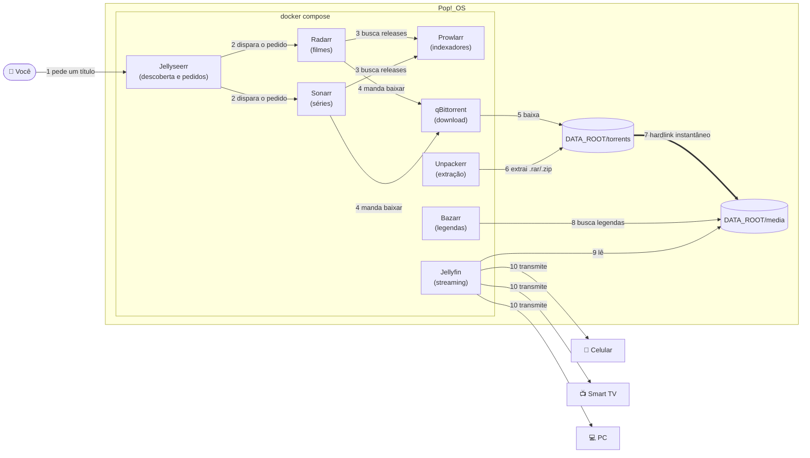

# 🎬 Media Vault

**Sua própria Netflix — sem limite de qualidade e sem assinatura.**

[](LICENSE)


Servidor pessoal de streaming para acessar seu acervo de qualquer dispositivo na rede local — celular, PC ou Smart TV — com organização, metadados e downloads 100% automatizados. Peça um título, a casa toda assiste em qualidade de cinema.

---

## O que este repositório entrega

Media Vault não é só "um Jellyfin com Docker Compose". É uma esteira completa de automação:

1. Você (ou qualquer pessoa da casa) **pede** um filme ou série pela interface do Jellyseerr.
2. **Radarr/Sonarr** encontram o melhor release disponível — priorizando Remux e qualidade máxima — através dos indexadores cadastrados no **Prowlarr**.
3. **qBittorrent** baixa; **Unpackerr** extrai automaticamente qualquer `.rar`/`.zip`; Radarr/Sonarr **organizam e renomeiam** o arquivo na estrutura que o Jellyfin espera, movendo-o via **hardlink** — instantâneo, sem gastar I/O nem duplicar espaço em disco.
4. **Bazarr** varre múltiplas fontes atrás de legendas.
5. **Jellyfin** cataloga tudo com capa, sinopse, elenco e trailers, e transmite para qualquer tela da casa.

Zero intervenção manual depois do pedido inicial. E como espaço em disco não é o gargalo deste projeto, a prioridade em cada etapa é sempre a mesma: a **maior qualidade disponível**, sem recompressão desnecessária.

> Nasceu de um problema chato e comum: apps de player podem sumir da loja de um dia para o outro (foi o que aconteceu com o VLC na Samsung Store). A solução virou um servidor próprio — e, no caminho, cresceu para uma stack de automação completa.

---

## 🏗️ Arquitetura

| Serviço | Papel |
|---|---|
| 🎬 **[Jellyfin](https://jellyfin.org/)** | O media server. Indexa a biblioteca já organizada, transcodifica sob demanda e transmite para qualquer tela — 100% open source, sem assinatura. |
| 🔎 **[Jellyseerr](https://github.com/Fallenbagel/jellyseerr)** | O portal de descoberta e pedidos. Procure um título, peça com um clique — a stack cuida do resto sozinha. |
| 🎞️ **[Radarr](https://radarr.video/)** | O curador de filmes: monitora pedidos, escolhe o melhor release disponível e aciona o download. |
| 📺 **[Sonarr](https://sonarr.tv/)** | O mesmo trabalho do Radarr, episódio por episódio, temporada por temporada. |
| 🗂️ **[Prowlarr](https://prowlarr.com/)** | O hub de indexadores: cadastre seus trackers uma vez, ele sincroniza automaticamente com Radarr e Sonarr. |
| ⬇️ **[qBittorrent](https://www.qbittorrent.org/)** | O motor de download — cliente torrent leve, com WebUI e categorias por tipo de mídia. |
| 📦 **[Unpackerr](https://github.com/Unpackerr/unpackerr)** | O "abridor de pacotes": extrai arquivos compactados assim que o download termina, sem intervenção manual. |
| 💬 **[Bazarr](https://www.bazarr.media/)** | O caçador de legendas: varre múltiplas fontes por tudo que entra na biblioteca. |



### Por que Jellyfin, e não Plex/Emby?

Curto: porque é 100% open source e gratuito — sem funcionalidades de acesso remoto trancadas atrás de assinatura — e, desde 2026, também tem app nativo na Samsung Store. Emby resolve de forma parecida, mas parte dele é pago. Plex é mais polido, mas cobra pelo essencial. Para quem quer controle total do próprio acervo, Jellyfin ainda é a escolha mais coerente.

---

## 🎯 Qualidade acima de tudo

Este projeto assume que **espaço em disco não é o gargalo** — sua atenção é. Por isso, cada peça da stack é configurada para preservar o arquivo original:

- **Remux, não re-encode.** Radarr/Sonarr são configurados para priorizar releases Remux (cópia bit-a-bit do disco original, sem recompressão) sobre encodes menores. Você troca espaço em disco por fidelidade ao master.
- **Áudio sem perdas.** Faixas TrueHD, DTS-HD MA e afins passam direto — o Jellyfin faz *Direct Play* sempre que o dispositivo suporta, sem tocar num único bit do áudio.
- **Transcodificação é exceção, não regra.** Ela só entra em cena quando um cliente específico não consegue reproduzir o codec/container original, e pode ser acelerada por hardware (Intel Quick Sync / AMD VA-API) descomentando a seção `devices` do Jellyfin no `docker-compose.yml`.
- **Metadados densos.** Capa, sinopse, elenco, trailers e legendas em múltiplos idiomas — tudo buscado automaticamente, sem passar por um gerenciador manual.

---

## ⚡ Hardlinks: zero cópia, zero desperdício de I/O

Esse é o motivo pelo qual a estrutura de pastas deste repositório é diferente da maioria dos tutoriais por aí.

Quando o Radarr/Sonarr importa um download finalizado, ele pode:

- **Copiar** o arquivo inteiro da pasta de downloads para a biblioteca — dobra o uso de disco por um tempo e gasta minutos de I/O num Remux 4K de 80 GB; ou
- Criar um **hardlink** — uma segunda entrada no sistema de arquivos apontando para os mesmos blocos de dados, instantânea e sem gastar espaço extra (o *Atomic Move* do [TRaSH Guides](https://trash-guides.info/)).

Hardlinks só funcionam quando origem e destino estão **no mesmo sistema de arquivos**. Por isso toda a stack usa uma única raiz, `DATA_ROOT`, com `torrents/` (downloads) e `media/` (biblioteca final) como subpastas dela — nunca discos ou partições separados. O resultado: o arquivo que o qBittorrent baixa é "movido" para a biblioteca em milissegundos, sem reescrever um único byte no disco.

---

## 🚀 Início rápido

```bash
git clone https://github.com/Canela-san/Media-vault.git
cd media-vault
cp .env.example .env
nano .env               # ajuste DATA_ROOT, PUID/PGID e as portas se precisar
docker compose up -d
```

| Serviço | Endereço padrão |
|---|---|
| Jellyfin | `http://IP-DO-SERVIDOR:8096` |
| Jellyseerr | `http://IP-DO-SERVIDOR:5055` |
| Radarr | `http://IP-DO-SERVIDOR:7878` |
| Sonarr | `http://IP-DO-SERVIDOR:8989` |
| Prowlarr | `http://IP-DO-SERVIDOR:9696` |
| Bazarr | `http://IP-DO-SERVIDOR:6767` |
| qBittorrent | `http://IP-DO-SERVIDOR:8080` |

Para descobrir o IP do servidor na rede local:

```bash
./scripts/get-lan-ip.sh
```

---

## 🔧 Configuração pós-instalação

O `docker compose up -d` só sobe os containers — a "cola" entre eles é feita uma vez, pela interface de cada app. Os endereços abaixo assumem as portas padrão do `.env.example`; ajuste se você mudou alguma delas.

1. **Prowlarr** → cadastre seus indexadores em *Indexers*, depois conecte Radarr e Sonarr em *Settings → Apps* (ele sincroniza os indexadores automaticamente daí em diante).
2. **Radarr / Sonarr** → em *Settings → Download Clients*, adicione o qBittorrent (`http://qbittorrent:8080`); em *Settings → Media Management*, aponte a *Root Folder* para `/data/media/movies` (Radarr) e `/data/media/tv` (Sonarr), e ative **"Use Hardlinks instead of Copy"** em *Completed Download Handling* — esse é o passo que liga o Atomic Move descrito acima.
3. **qBittorrent** → crie categorias `movies` e `tv` salvando em `/data/torrents/movies` e `/data/torrents/tv`, para bater com os caminhos que o Radarr/Sonarr esperam.
4. **Unpackerr** → copie a *API Key* do Radarr e do Sonarr (*Settings → General → Security*), cole em `RADARR_API_KEY` e `SONARR_API_KEY` no `.env`, e rode `docker compose up -d` de novo.
5. **Jellyseerr** → conecte à sua conta Jellyfin e, em *Settings*, aponte para as instâncias de Radarr/Sonarr já configuradas.

---

## 📖 Documentação

- [Configurando bibliotecas no Jellyfin](docs/configurando-jellyfin.md)
- [Acessando pela Smart TV Samsung](docs/smart-tv-samsung.md)
- [Controlando acesso a bibliotecas por usuário](docs/controle-de-acesso-por-usuario.md)

## 📋 Requisitos

- Linux com Docker Engine + plugin `docker compose` ([guia oficial](https://docs.docker.com/engine/install/ubuntu/), compatível com Pop!_OS)
- Acesso de rede local entre o servidor e os dispositivos clientes
- Pelo menos um indexador (público ou privado) configurado no Prowlarr

## Licença

[MIT](LICENSE)

---

<p align="center"><i>Feito para quem não troca um Remux 4K por espaço em disco.</i></p>